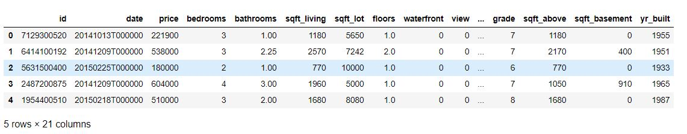
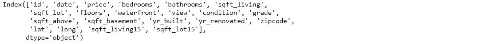
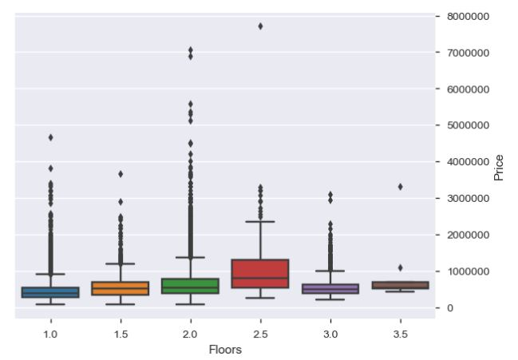
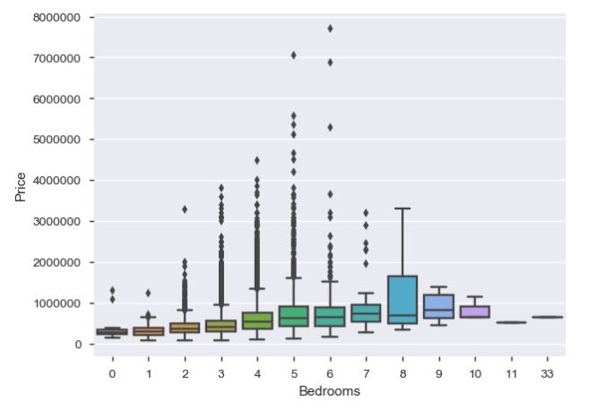
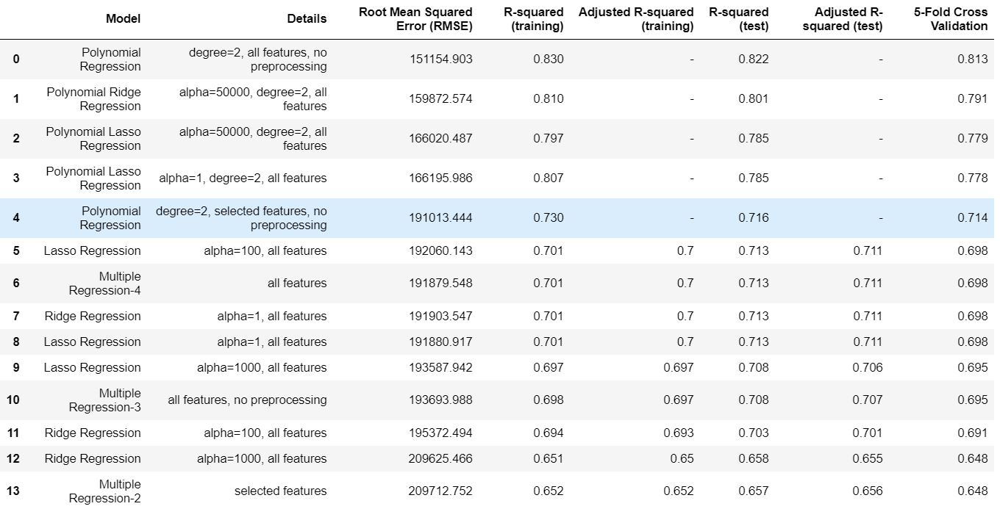

# House Price Prediction

## INTRODUCTION
We will predict house price based on various features related to house selling.We will try to find out relations between dependant and independant variables using EDA. After EDA we will apply machine learning models to find predicted price for house and will compare multiple models to for accuracy.

## DATA
| Column Name | Description |
| --- | --- |
| `Date` | Date of the home sale|
| `Price` | Price of each home sold|
|`Bedrooms`| Number of bedrooms |
|`Bathrooms`| Number of bathrooms, where .5 accounts for a room with a toilet but no shower |
|`Sqft_Living`| Square footage of the apartments interior living space |
|`Sqft_Lot`|  Square footage of the land space|
|`Floors`| Number of floors |

## Project Analysis
| Description | Analysis |
| --- | --- |
| `house_price.head` | 
| `house_price.columns` | 

## Insights from Data
| Description | Plot |
| --- | --- |
|`Floors Vs Price`| |
|`Grade Vs Price`| |
|`BedRooms Vs Price`| |
|`Final Model Evaluation`| |

## Jupyter NoteBooks
* [Jupyter Notebook House Price Predcition](./HousePricePrdiction.ipynb)

## Conclusion
When we look at the evaluation table, 2nd degree polynomial (all features, no preprocessing) is the best. However, I have doubts about its reliability. I would prefer the polynomial ridge regression (alpha=50000, degree=2, all features) but other models might be useful depending to the situation too.
